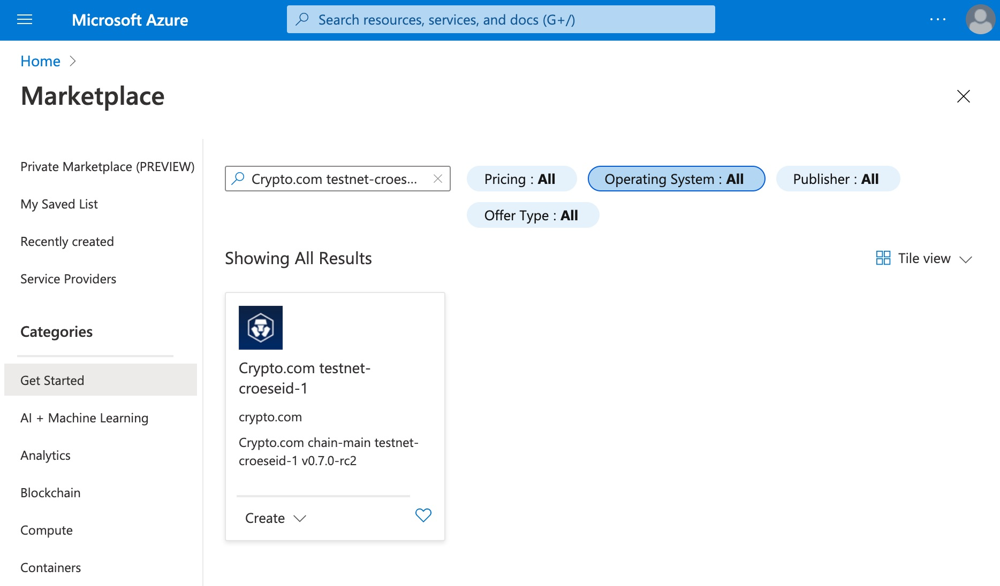
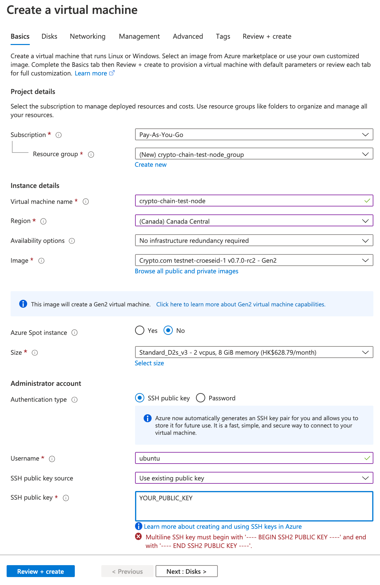
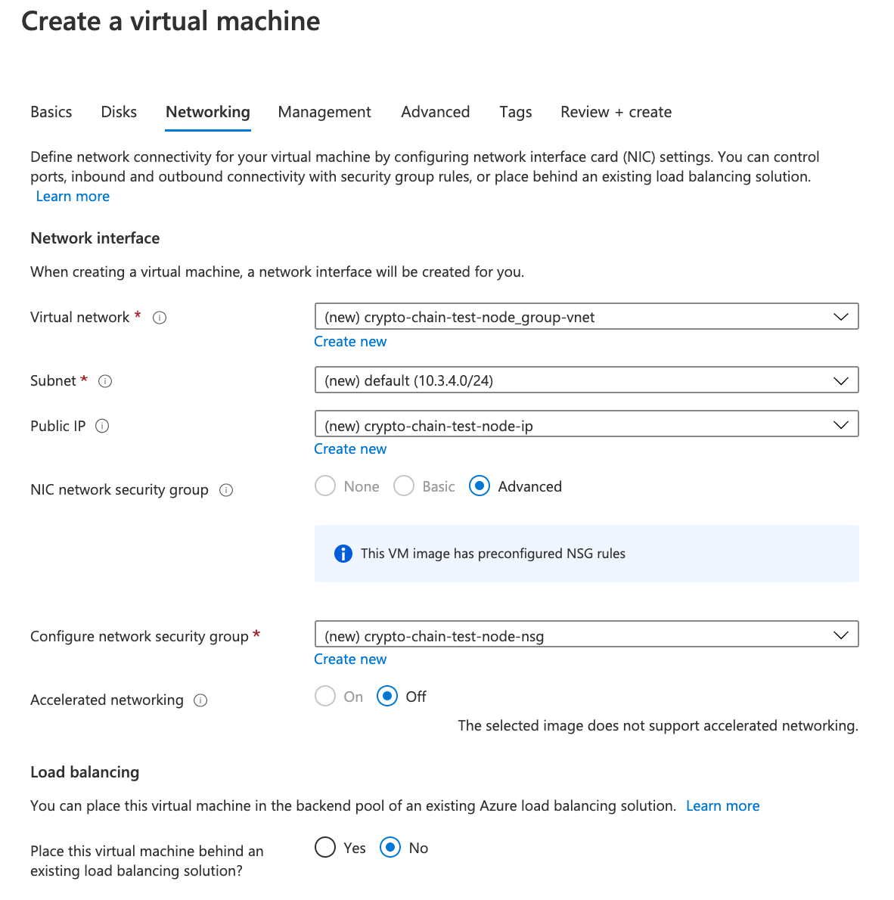

# Croeseid Testnet: Running Nodes using Azure 1-click Deployment

This tutorial will use our Azure 1-click Deployment image to start and create the latest Croeseid Testnet validator or full node.

## Step 1. Azure Account Creation

You will first need to create an [Microsoft Azure](https://azure.microsoft.com/) account with a `Pay-As-You-Go` subscription. This will require providing your credit card information to `Microsoft Azure` and you may be subject to charges when you create a virtual machine.

Please read `Microsoft Azure` free trial introduction to see if you are eligible for the free-tier.

## Step 2. Common Setup

### Step 2-1. Search for Crypto.com Chain on Marketplace

Sign in to your Microsoft Azure account and go to [Marketplace](https://portal.azure.com/#blade/Microsoft_Azure_Marketplace/MarketplaceOffersBlade/selectedMenuItemId/home). Search for "Crypto.com testnet-croeseid-1".



### Step 2-2. Create a Virtual Machine

Choose the image and click "Create" to start creating the Crypto.com chain testnet node.

#### 1. Basic



| Configuration           | Value                                                                                                            |
| ----------------------- | ---------------------------------------------------------------------------------------------------------------- |
| _Region_                | DCsv2-series VMs for Azure are widely available in regions like _East US_, _Canada Central_, _UK South_, etc     |
| _Size_                  | Select a recommended one or _DC2s_v3_                                                                            |
| _SSH public key source_ | Choose _"existing public key"_                                                                                   |
| _SSH public key_        | Copy and past your [SSH public key](https://docs.microsoft.com/azure/virtual-machines/linux/mac-create-ssh-keys) |
| _Resource group_        | We suggest to create a new and dedicated one so that you can easily manage resources attached to the instance    |

#### 2. Disk

- Follow default setting

#### 3. Networking



- _Virtual network_, _Subnet_, _Public IP_ and _NIC_: "Create new" if you don't have any in that region

#### 4. Management

- Follow default setting
- _Boot diagnostics_: default is "On". Set to "Off" if it is not required.

#### 5. Advanced

- Follow default setting

#### 6. Tags

- Create Tag if needed

#### 7. Review + Create

- Click "create" to create your instance

### Step 2-3. Connect to your instance

Once the deployment is completed, you can connect to your instance via SSH. Afterwards, go to the `chain` directory, and you will find all the essential binaries for setting up your node:

```bash
$ cd /chain/
$ ll
total 44
drwxr-xr-x  8 root   root   4096 Nov 23 14:11 ./
drwxr-xr-x 24 root   root   4096 Nov 27 03:30 ../
drwxr-xr-x  4 crypto crypto 4096 Nov 23 14:11 .chain-maind/
drwxr-xr-x  5 crypto crypto 4096 Nov 23 14:10 .tmkms/
drwxr-xr-x  2 crypto crypto 4096 Nov 23 14:12 bin/
-rwxr-xr-x  1 crypto crypto  316 Nov 23 14:03 cleanForAMI.sh*
drwxr-xr-x  2   3434   3434 4096 Jun  4  2019 node_exporter-0.18.1.linux-amd64/
-rwxr-xr-x  1 crypto crypto 5858 Nov 23 14:03 reconfig.sh*
drwxr-xr-x  2 root   root   4096 Nov 23 14:03 release_binary/
drwxr-xr-x  2 crypto crypto 4096 Nov 23 14:09 sockets/
```


## Step 3. Running a full node
### Step 3-1. Use the reconfiguration script
Now we use the reconfiguration script `reconfig.sh` to clean up the old data (if any) and obtain a fresh consensus public key, which is necessary for running a validator.
```bash
$ sudo -u crypto ./reconfig.sh
....
....
Reset chain-maind and remove data if any
❗️ Enter (Y/N) to confirm delete old data: y
Stopping chain-maind tmkms service
Removed all blockchain history               module=main dir=/chain/.chain-maind/data
```

To join the network as a validator, the consensus public key is required. The consensus public key will be printed after generating tmkms signing key.

```bash
Generated private validator file             module=main keyFile=/chain/.chain-maind/config/priv_validator_key.json stateFile=/chain/.chain-maind/data/priv_validator_state.json
🔄 Regenerate tmkms consensus-ed25519 key 🔑
   Generated consensus (Ed25519) private key at: /chain/.tmkms/secrets/consensus-ed25519.key
🔄 Regenerate tmkms validator secret key 🔑
🕑 Waiting for tmkms to run

✅ Please keep consensus public key for node join if it is validator or find it again in /chain/log/tmkms/tmkms.log. It will show again when restart tmkms in log

Consensus public key for node join: tcrocnclconspubXXXXXXXXXXXXXXXXXXXXXXXXXXXXXXXXXXXXXXXXXXXXXXXXXXXXXXXXXXXXXXXXXXX

```

The script will also ask you to fill in the `moniker` value which is a human readable display name for tendermint p2p.

```bash
Replace moniker in /chain/.tendermint/config/config.toml
Moniker is display name for tendermint p2p

moniker: YOUR_MONIKER_NAME
```

You may also enable [STATE-SYNC](https://docs.tendermint.com/master/tendermint-core/state-sync.html) to speed up the block syncing process.
_p2p gossip_ will allow you to connect with more nodes (data sources).
```bash
Do you want to enable state-sync? (Y/N): y
Do you want to add the public IP of this node for p2p gossip? (Y/N): y
✅ Added public IP to external_address in chain-maind config.toml for p2p gossip
```
_node_id_ and _node_key_ are the unique identity of your node. Save them for later use.

```
Generate and replace node_key in /chain/.chain-maind/config/node_key.json

You may want to save node_id and node_key for later use

node_id: 62cf74XXXXXXXXXXXXXXXXXXXXXXXXXXXXXXXXXX

node_key: LyQiGlL4HsdHsPXXXXXXXXXXXXXXXXXXXXXXXXXXXXXXXXXXXXXXXXXXXXXXXXXXXXXXXXXXXXXXXXXXXXXXXXXX
```
`chain-maind` is now running at the background. 

You can check its log by the command `journalctl`, for example:

```bash
$ journalctl -u chain-maind.service -f
-- Logs begin at Mon 2020-11-23 13:21:03 UTC. --
Nov 25 09:27:41 crypto-chain-test-node chain-maind[3209]: I[2020-11-25|09:27:41.854] Executed block                               module=state height=545512 validTxs=0 invalidTxs=0
Nov 25 09:27:41 crypto-chain-test-node chain-maind[3209]: I[2020-11-25|09:27:41.866] Committed state                              module=state height=545512 txs=0 appHash=B989A1B3E225A6BCBB4D61072E83A9EB3F9C480CE8CFDBCC4B3469620D314F99
Nov 25 09:27:48 crypto-chain-test-node chain-maind[3209]: I[2020-11-25|09:27:48.271] Executed block                               module=state height=545513 validTxs=1 invalidTxs=0
Nov 25 09:27:48 crypto-chain-test-node chain-maind[3209]: I[2020-11-25|09:27:48.287] Committed state                              module=state height=545513 txs=1 appHash=D55A839445CD58DD8EAD27D8FA87ACAF88695BE47CDE4FFCD456421EB7800775
...
```

Once the tendermint syncs to the latest block, the setup is done! You may move on to the next step if you want to join the network as a validator.

## Step 4. Join as a validator
We suggest that you should do this process locally with `chain-maind` to avoid exposing your keys on a cloud server.
If you haven't installed `chain-maind` yet, please follow [Step 1. Get the Crypto.com Chain binary](./croeseid-testnet.html#step-1-get-the-crypto-com-chain-binary).
:::tip NOTE

- Check whether your chain-maind is the testnet binary (end with `-rc2`)
```bash
$ chain-maind version
0.7.0-rc2
```
- Testnet binary for
[Mac](https://github.com/crypto-com/chain-main/releases/download/v0.7.0-rc2/chain-main_0.7.0-rc2_Darwin_x86_64.tar.gz) and [Windows](https://github.com/crypto-com/chain-main/releases/download/v0.7.0-rc2/chain-main_0.7.0-rc2_Windows_x86_64.zip) are also available.
:::

### Step 4-1. Create a new key and address

Run the followings to create a new key. For example, you can create a key will the name `Default` by:

```bash
  $ chain-maind keys add Default
```

You should obtain an address with `tcro` prefix, e.g. `tcro1quw5r22pxy8znjtdkgqc65atrm3x5hg6vycm5n`. This will be the address for performing transactions.

### Step 4-2. Obtain test token

Unless you have obtained the CRO testnet token before, use the [CRO faucet](https://chain.crypto.com/faucet) to obtain test CRO tokens.
In case you have reached the daily limit on faucet airdrop, you can simply send a message on [Gitter](https://gitter.im/crypto-com/community),
stating who you are and your `tcro.....` address (@devashishdxt or @lezzokafka would typically reply within a day).

### Step 4-3. Running a validator node
```bash
$ chain-maind tx staking create-validator \
--from=[name_of_your_key] \
--amount=500000tcro \
--pubkey=[tcrocnclconspub...]  \
--moniker="[The_id_of_your_node]" \
--security-contact="[security contact email/contact method]" \
--chain-id="testnet-croeseid-1" \
--commission-rate="0.10" \
--commission-max-rate="0.20" \
--gas 800000 \
--commission-max-change-rate="0.01" \
--min-self-delegation="1" \
--gas-prices 0.1basetcro \
--node https://testnet-croeseid-1.crypto.com:26657

## Transactions payload##
{"body":{"messages":[{"@type":"/cosmos.staking.v1beta1.MsgCreateValidator"...}
confirm transaction before signing and broadcasting [y/N]: y
{"height":"545811","txhash":"89314DB8492B14EE35991A9880FF6C89B02FA04880EB33A2DADF25F419F0E59E","codespace":"",...}
```
You will be required to insert the following:

- `--from`: The `trco...` address or name of your key in [Step 4-1](#step-4-join-as-a-validator) that holds your funds;
- `--pubkey`: The consensus public key in [Step 3-1](#step-3-1-use-the-reconfiguration-script) with **tcrocnclconspub** as the prefix;
- `--moniker`: A moniker (name) for your validator node in [Step 4-1](#step-4-join-as-a-validator);
- `--security-contact`: Security contact email/contact method.

### Step 4-4. Check if the validator has been set
Now you can check if your validator has been added to the validator set:

```bash
$ chain-maind query tendermint-validator-set --node https://testnet-croeseid-1.crypto.com:26657 | grep -c [tcrocnclconspub...]
## 1 = Yes; 0 = Not yet added ##
```

Congraduations! You've sucessfully joined the network as a validator!
